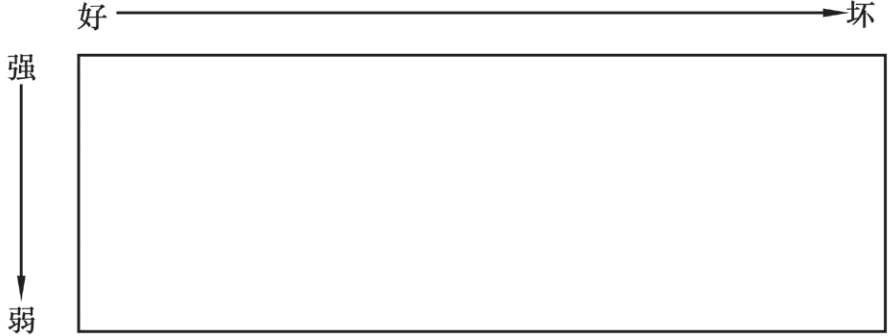

# 流水落叶练习

把想法放到落叶上—“在下面的时间,请留意任何在你脑海中显现的东西… 也许是一个想法, 一个影像或者一种情绪…不论是什么,看看你是否可以把它放到一片落叶上…不论是愉悦的还是不愉悦的…时时刻刻,留意任何在你心里浮现的体验,把它放到一片落叶上,并看着它们自然地飘走…不需要去加速或者放慢 （暂停至少20秒）

如果你的大脑变成空白,你只要保持平静…而且时刻警悌任何可能会出现的想法…”

“ 如果你有这样的想法—‘这好奇怪’或者‘这好无聊’或者‘这太难了或太容易了’再或者‘我不会做得对的’或者‘我没有想法’—把这些想法放到一片叶子上,看着它们飘走。”

“ 如果一个痛苦的感觉出现,只要承认它。对自己说:‘我留意到了我有一个痛苦的感觉’再把它放到一片叶子上,并看着它飘走。

如果你的注意力溜号了,只要轻轻把自己带回到这个练习上…不需要做评判

“有时我们会对冥想本身有某些期待。比如，如果我们在练习后感觉不到更平静和更不焦虑，我们可能会感到沮丧。这就是为什么有些人会抱怨—“这对我没效果”。其实，正念冥想不是指要去努力实现任何理想状态，有这样的期待反而会阻碍正念练习。如果你有这些期待和评价，看你是否可以留意到并放下那些评价。”

# 及时追踪自己的想法

为了能更清楚地说明问题，我们希望你在接下来的5分钟里追寻一下自己想法出现的时间。

将手指放在下面的时间刻度上。当想法和感觉出现时，在时间刻度上滑动，指出该想法或是感觉对应的时间。你会注意到，时间刻度上有5个时间点：遥远的过去，不远的过去，现在，很近的将来，遥远的将来。任何想法出现时，你都可以选择任何一个时间点

如果你也随着思绪漂浮，要留意。如果你的想法是和未来或是过去有关的，那么就注意自己现在正有这样的想法。
如果你太过刻意（​“我必须在接下来的5分钟里让手指停留在‘现在’这个地方”​）​，实际上就陷入到了语言中的未来，或是过去（​“我没完成这个练习！”​）​。如果出现这样的情况，那么就留意一下自己现在有这样的念头，让自己不要和这个念头融合在一起

# 留意身体的感受

当出现某种感觉时，用一个手指指着左边最能准确描述你的感觉的词汇。用另一只手，指出这个感觉出现在身体的什么部位。
你也许注意到了，在练习的过程中出现了不同的感觉。身体上的感受有可能从一个地方转移到另一个地方，时不时地出现，和其他的事物一样

# 解离隐含评价的融合

刚才你练习过捕捉自己的思维何时从当下游离开，现在我们希望你练习捕捉自己何时陷入到评价中。
当评价的念头清晰时，很容易就能捕捉到。
评价只会出现在一些有限的范围之内。好-坏和强-弱是两种最主要的对立形式。
看看下面这个盒子，留意一下，盒子周围有4个不同的区域。把这个看成坐标方格，在上面你可以就自己评价的本质标注出好或坏、强或弱的程度。
如果你能从评价中认知解离，你会发现自己将手指向下挪到了盒子底部的中间部分（很弱，既不好也不坏）​，然后将手指从中拿开

## 参考

- Leaves on a stream. Pressbooks. https://pressbooks.library.torontomu.ca/empowerment/chapter/leaves-on-a-stream/
- Hayes, Steven C. Get out of your mind and into your life.《跳出头脑，融入生活》
